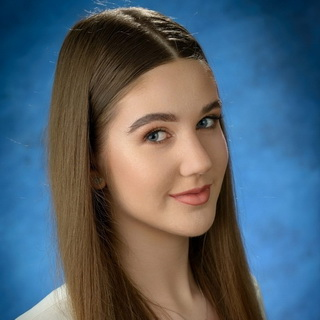
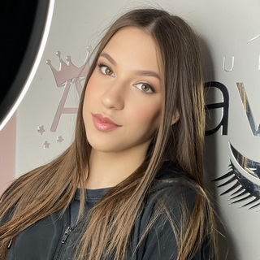
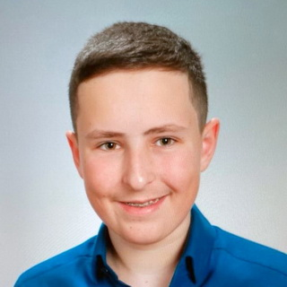
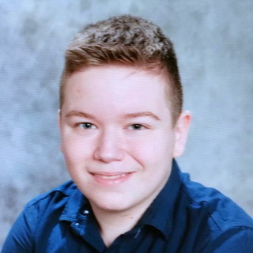
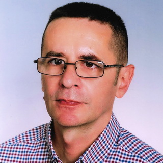

# Компанија ID Solutions

Ученичка компанија **ID Solutions** функционише као технолошки стартап у
програму [Достигнућа младих у Србији](program.md). Основана је септембра 2025.
године у Школском центру "Никола Тесла" у Вршцу.

|  |  |  |  |  |
|:-:|:-:|:-:|:-:|:-:|
| CEO | CFO | CTO | COO | Ментор |
| Ана Ђурић | Мила Поповић | Алекса Варићак | Огњен Стојанов | Велимир Радловачки |

Ана и Мила ученице су II разреда смера Техничар информационих технологија, док
су Алекса и Огњен ученици III разреда смера Електротехничар информационих
технологија. Ментор ученичке компаније је професор Велимир Радловачки,
предметни професор Програмирања и одељенски старешина Алексе и Огњена, и
предметни професор Веб дизајна и Дизајна интерфејса Ане и Миле.

## Наши почеци

Наша иницијална идеја била је да сами направимо уређај помоћу којег би
програмирали бесконтактне паметне картице, и то од компонената које су нам
доступне у школи. У томе смо донекле и успели - искористили смо микроконтролер
Arduino UNO и RFID-RC522 модул и направили функционалан читач/програмер. То је
било довољно да креирамо MVP и добијемо повратне информације о нашем производу.
Међутим, брзо смо увидели да је тржиште преплављено разним бесктонтактним
решењима са интегрисаним колима које наш уређај не може да прочита.

## Садашњост и будућност

За претходних шест месеци наша компанија се опремила најсавременијим уређајима
за рад са бесконтактним и контактним паметним картицама. Стекли смо експертизу
и искуство тестирањем мноштва софтверских решења, интерфејса и транспонера.

У наредном периоду планирамо да проширимо производне капацитете и асортиман
услуга, набавимо штампач картица и креирамо веб-шоп.
