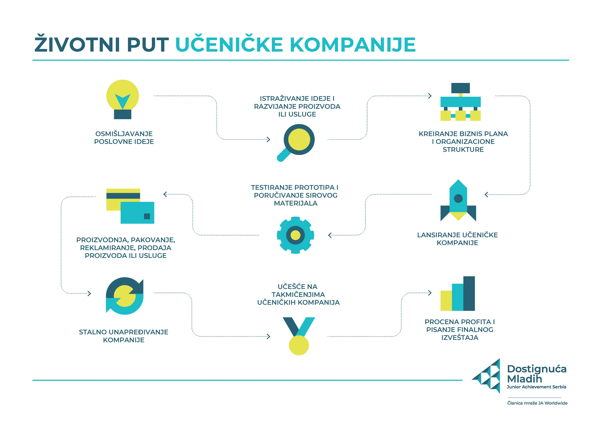

# Програм Ученичка компанија

Ученичка компанија је образовни програм организације
[Достигнућа младих у Србији](https://www.ja-serbia.org/) који нам је омогућио
да будемо укључени у развој и вођење сопствене компаније, са реалним
производима и услугама.

Прочитајте више о овом програму на веб сајту организације
[Достигнућа младих у Србији](https://www.ja-serbia.org/preduzetnicko-obrazovanje/programi-za-srednje-skole/).

