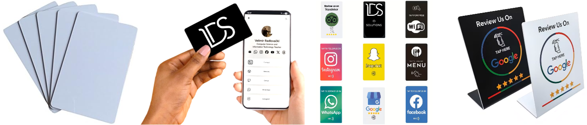
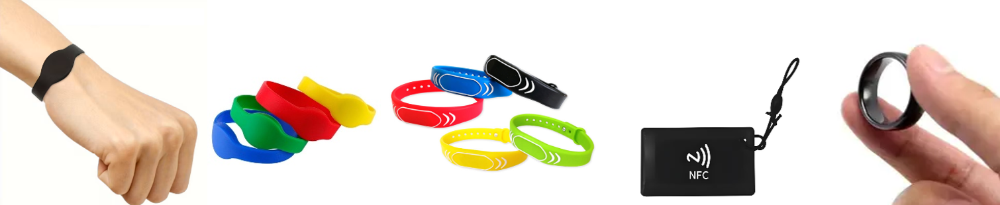
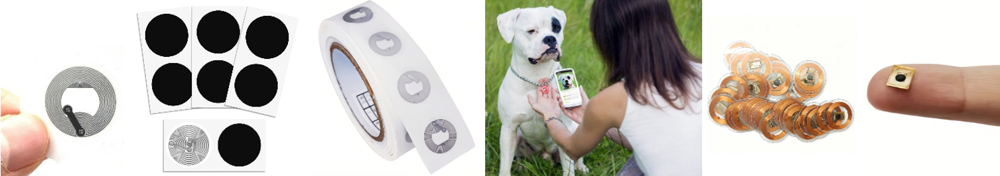

---
hide:
  - navigation
  - toc
---

<b>ИНОВАТИВНИ ПРИСТУПИ У ДИГИТАЛИЗАЦИЈИ ИДЕНТИФИКАЦИОНИХ РЕШЕЊА</b>

Заборавите скенирање QR кодова класичне визит-картице, скупу штампу каталога,
ценовника и менија! Наши иновативни производи за идентификацију доносе освежења
у Ваш пословни и персонални свет! Они су економични, еколошки, практични и
омогућавају лако дељење информација.

Наши производи, на додир са телефоном, могу да:

* прикажу персонализован онлајн профил
* прикажу веб сајт или други онлајн садржај
* прикажу гео-локацију на мапи или навигацији
* повежу телефон на Wi-Fi или Bluetooth уређај
* додају контакт податке у именик телефона
* прикажу здравствене податке
* покрену Bitcoin трансакцију
* пошаљу SMS или мејл, позову број и др.

### Бесконтактне картице и сталци

Бесконтактне картице и сталци су издржљиви, водоотпорни и поуздани, а
програмирани подаци су трајни и безбедни и могу се ажурирати више хиљада пута.
Намењени су предузетницима, предузећима, угоститељским објектима, хотелима,
салонима и свим онима којима је стало до професионалног првог утиска. Идеални
су за дељење портфолија, линкова, профила на друштвеним мрежама, менија,
ценовника и др.

### Бесконтактне наруквице, привесци и прстење

Бесконтактне наруквице, привесци и прстење, истих карактеристика, намењене су
деци, старијим особама и особама са здравственим проблемима. Могу да садрже
важне контакт податке, локацију или здравствене податке, као што су информације
о алергијама, хроничним болестима, крвној групи или терапији. У случају несреће
или изненадног здравственог инцидента, свако ко поседује паметни телефон може
тренутно добити кључне информације и пружити помоћ.

### Бесконтактне налепнице и тагови за уградњу

Бесконтактне налепнице и тагови за уградњу, истих карактеристика, представљају
најсвестраније решење јер се могу залепити или уградити готово свуда – на
производе, амбалажу, излоге, столове, плакате, машине, намештај или рекламне
материјале. Најпопуларнији производ са уграђеним тагом је огрлица за псе која
приказује онлајн профил пса и контакт информације власника

### Персонализација производа

Наше производе можете поручити **бланко** - без дигиталне штампе, са
**дигиталном штампом** или са **ласерским гравирањем**.

Такође, уколико немате **онлајн профил** или неки други **ресурс на интернету**
који треба да се прикаже, ми га можемо направити!

## Додатне услуге

* **Клонирања RFID кључева (тагова).** По најповољнијим ценама можемо ископирати
RFID кључ од Ваше зграде, улазних врата или гараже на привезак или картицу, без
обзира да ли таг ради у LF или HF RFID опсегу.\*
* **Очитавања личних докумената.** По најповољнијим ценама можемо очитати и
одштампати или вам послати електронском поштом дигитални садржај Ваше личне
карте, саобраћајне дозволу или здравствене књижице.
* **Бекап података са различитих медијума**. По најповољнијим ценама можемо
бекаповати Ваше податке са меморијских картица *(Secure Digital (SD), microSD,
CompactFlash (CF), Memory Stick, MultiMediaCard (MMC))*, бекаповати именик са
SIM картице *(Full-size SIM, Mini SIM, Micro SIM, Nano SIM)* и бекаповати
магнетни запис са картица са магнетном траком *(HiCo, LoCo, са 2 или 3 стазе)*.

\* *Напомена: Цена клонирања HF RFID кључа може да порасте уколико је кључ
кодиран CRYPTO-1 алгоритмом. Цена клонирања може значајно да порасте уколико је
кључ кодиран AES алгоритмом, где је потребан и физички приступ уређају за
очитавање кључа (и излазак на терен уколико је уређај већ монтиран). У
одређеним случајевима, клонирање кодираних HF RFID кључева није могуће.*
