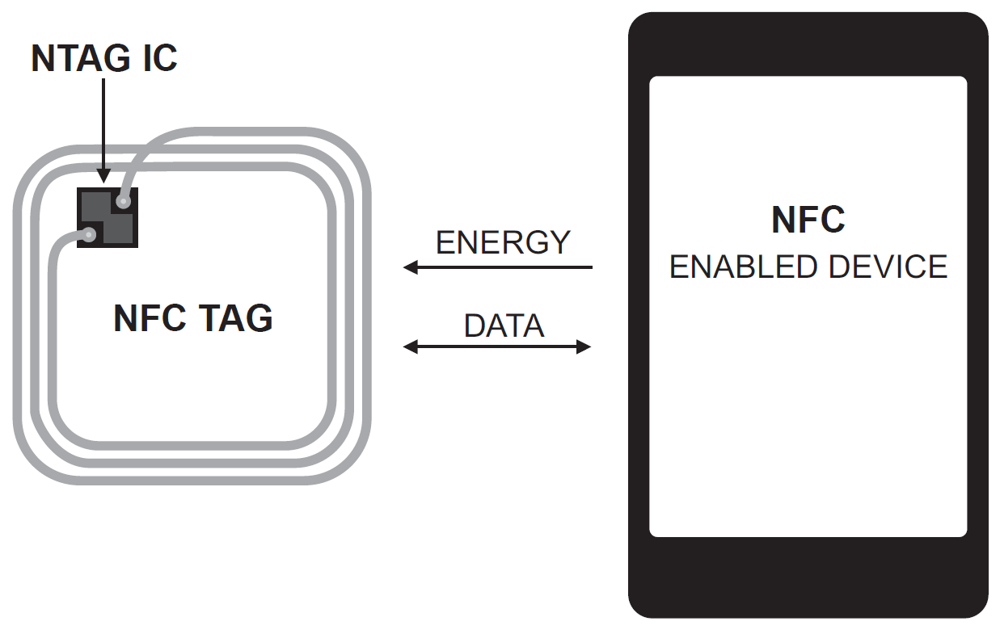

# NFC

NFC (*Near Field Communication*) је технологија бежичне комуникације кратког
домета која омогућава размену података између два уређаја када се налазе на
удаљености од неколико центиметара.

NFC технологија је данас свеприсутна у паметним телефонима (за бесконтактно
плаћање, упаривање уређаја, читање тагова), у бесконтактним картицама (платне
картице, картице за јавни превоз, картице за приступ и идентификацију), на NFC
привесцима, наруквицама и стикерима (за личну или комерцијалну употребу), у
индустрији, продаји и логистици (праћење и контрола производа, ).

NFC технологија заснива се на индуктивној спрези између две антене које раде на
истој фреквенцији. Један уређај (на пример, телефон или NFC читач) ствара
електромагнетно поље, док други (NFC таг или картица) користи то поље за
стварање електричне енергије и пренос података.

Постоје три режима рада NFC-а:

* **Reader/Writer** режим, где NFC уређај чита податке са NFC тага или пише
податке на NFC таг.
* **Card Emulation** режим, где се паметни телефон или неки други уређај понаша
као NFC таг (нпр. приликом бесконтактног плаћања).
* **Peer-to-Peer** режим, где два уређаја размењују податке (нпр. за пренос
контаката, линкова и слично).

Иако се NFC често посматра као посебна технологија, у суштини је реч о
специјализованој варијанти RFID-а. Значи, NFC је специфична имплементација RFID
технологије која ради искључиво у HF опсегу на 13.56 MHz и то са специфичним
протоколима.

Следећи стандарди дефинишу различите аспекте NFC технологије - од физичког
слоја до протокола за размену података:

* ISO/IEC 14443 (Тип A и B): Основни протокол
* ISO/IEC 18092 (NFCIP-1): NFC Interface and Protocol
* ISO/IEC 21481 (NFCIP-2): Други слој протокола
* ECMA-340, ECMA-352, ECMA-356: Алтернативне спецификације
* NFC Forum: Дефинише додатне спецификације
  * Type 1-5 tag formats
  * NDEF (NFC Data Exchange Format)
  * P2P (Peer-to-Peer) режим

NFC Forum је организација која окупља водеће компаније у овој области и
обезбеђује компатибилност уређаја и тагова различитих произвођача.

Водећи произвођачи NFC чипова и тагова су:

* NXP Semiconductors: најпознатији по NTAG серији NFC чипова.
* STMicroelectronics: производи ST25 серију NFC чипова.
* Sony: један од пионира NFC технологије, креатор FeliCa система.
* Infineon Technologies: познат по решењима за безбедност и плаћања.
* Texas Instruments: производи Tag-it HF-I серију NFC чипова.
* Broadcom, Qualcomm и Samsung: интегришу NFC контролере у мобилне чипсете.

Због веома кратког домета, неовлашћени приступ или пресретање података је тешко
изводљиво у пракси. Потенцијални нападач мора бити изузетно близу уређаја да би
покушао да прислушкује NFC комуникацију. Сам NFC протокол не обезбеђује увек
шифровање података - оно зависи од примене. На пример, системи за бесконтактно
плаћање увек користе напредне технике шифровања попут динамичких криптографских
кључева, токенизације и двофакторске аутентификације корисника. Међутим,
једноставни NFC тагови без заштите могу бити лако преписани или клонирани.
